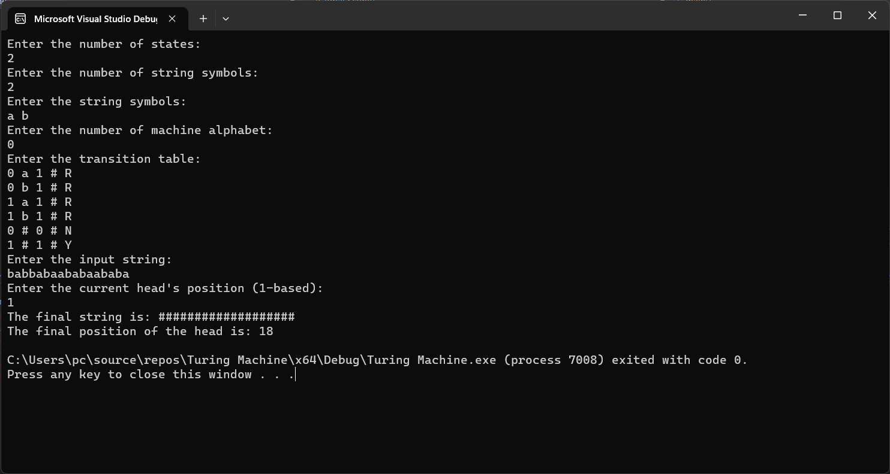

# Turing Machine Simulator

## This is a very simple implementation of a semi-decidable Turing machine that reads input from the user and perform computations according to the transition table.
### This project was done as part of the final project of the Theory of Computations course.
The program takes the input from the user as following:
1. Number of machine states.
2. Number of string symbols and the symbols as well as the machine's.
3. The transition function. This is the 5-tuples of a Turing machine and must be provided to the machine with every possible combination of states and symbols to avoid hanging. The program takes the input as 5-tupled characters as follows:
   - Q0 -> The current state that the machine is on.
   - Σ0 -> The current string pointed by the head.
   - Q1 -> The next state of the machine.
   - Σ1 -> The next symbol to be written on cell by the head (As the head of a Turing machine has the ability to read and write, hence making computations).
   - D -> The decision of the machine. Can be one of 4 options: 
     - R for going one cell to the right.
     - L for going one cell to the left.
     - Y for halting and accepting, hence exiting with code 0.
     - N for halting and exiting with code 1 (indicating some error occurred or the string was not accepted).
4. The sequence of characters (the string to be tested).
5. The initial position of the head (As the Turing machine's head can be manually replaced to any desired position on the infinite tape).

# Sample run:

The program then computes on the string and outputs to the user the final string as well as the final position of the head.
   
